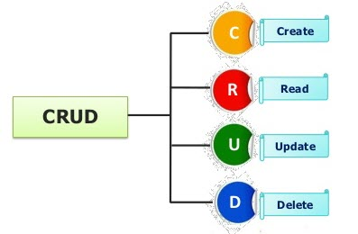

<h1>Contact App</h1>
<p><a href="https://capstonecontactapp.herokuapp.com/">Contact App</a> is a responsive app that allows the user to  <b>manage</b> contacts. </p>
<p>Now you <b>don’t need to worry </b> about losing contact numbers of your loved ones.
   My Contacts App enables users to easily store and find contact information, such as names, addresses, and telephone numbers.<p>


## Features ##

Users can:

- Try a demo account (unique instances of pre-populated sample entries)
- Create unique user account with username and password; login/logout
- Manage his contacts by performing the CRUD operations .



## Getting started
### Installing
```
>   git clone https://github.com/surbhiguptasai/CapstoneNodeContactApp.git
>   cd CapstoneNodeContactApp
>   npm install
```
### Launching
```
>   npm start
```
Then open [`localhost:8000`](http://localhost:8080) in a browser.
### Testing
```
>   npm run test
```

<h2>WireFrames</h2>
<p>Initial wireframes were created for each page. Mockups of all key processes were designed with user flow in mind.</p>


<h2>Technology & API</h2>
<ul>
  <li>HTML5</li>
  <li>CSS3</li>
  <li>Bootstrap</li>
  <li>JavaScript</li>
  <li>jQuery</li>
  <li>Ajax</li>
  <li>NodeJS</li>
  <li>MongoDB</li>
  <li>Chai</li>
   <li>Mocha</li>
</ul>
<h3>Responsive</h3>
<ul>
  <p>The app is fully responsive and quickly adapts to all mobile, tablet, and desktop viewports.</p>
</ul>

